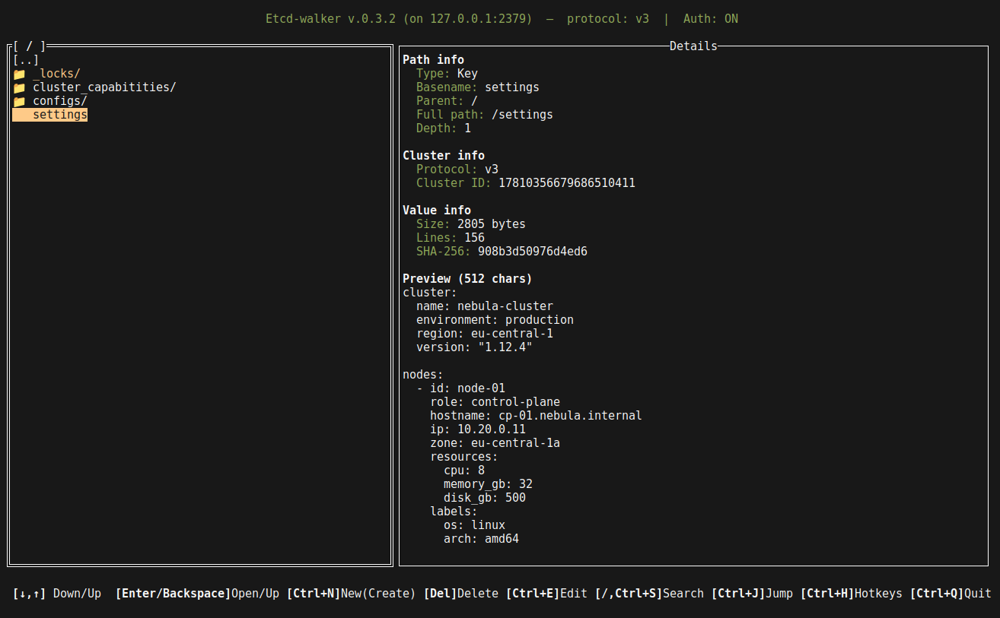

## Etcd-walker
_Interactive TUI for browsing and managing etcd v2 / v3 datastores_

`etcd-walker` is a terminal application that lets you navigate an etcd
key-value store as if it were a filesystem. You can browse, create, edit,
rename, delete and export keys and directories from a single curses-style
interface, with full support for etcd v2 (HTTP) and etcd v3 (gRPC) — including
authentication and TLS.



Grab the latest pre-built binaries / `.deb` packages here:
[latest version](https://github.com/nexusriot/etcd-walker/releases/latest)

---

### Features

- File-explorer style navigation of etcd keys/directories
- Create / read / update / delete keys and directories
- Rename keys and directories (including recursive directory rename)
- Set or clear a key's TTL / expiry (`Ctrl+T`), entered as seconds or a
  duration like `1h30m`; remaining TTL is shown live in the details pane
  (v3 via leases, v2 via native key TTL). Editing a key's value preserves
  its TTL instead of dropping it.
- Revision history for keys on etcd v3 (`Ctrl+V`): browse a key's stored
  MVCC revisions newest-first, inspect any old value (JSON pretty-print /
  hex for binary), see a colored line-diff against the current value, and
  restore an old value in one keystroke — the key's live TTL/lease is
  preserved. How far back it reaches depends on the cluster's compaction
  policy; v2 has no value history.
- Quick search inside the current level (`/` or `Ctrl+S`)
- Recursive find under the current directory (`Ctrl+F`) — case-insensitive
  substring match on key paths, optionally inside values, with a results
  picker that jumps straight to the match
- Duplicate a key or a whole directory subtree to a new path (`Ctrl+D`),
  TTLs/leases included; the source is left untouched
- Jump to an absolute or relative path (`Ctrl+J`)
- Multi-line editor for large key values (`Ctrl+E`)
- Details pane with size/lines/SHA-256, live TTL, etcd revisions
  (create/mod revision and version on v3), pretty-printed JSON preview and
  an xxd-style hex preview for binary values
- Listings are keys-only on v3 (values are fetched on focus), so browsing
  huge trees stays light
- Export the current directory to JSON (`Ctrl+W`)
- Import keys from a JSON file via a built-in filesystem browser, with
  overwrite / skip-existing modes (`Ctrl+O`)
- Copy a key path or value to the system clipboard, with OSC52 fallback
  for SSH / tmux sessions (`Ctrl+P`, `Ctrl+Y`)
- Etcd v2 and v3 support, plus an `auto` mode that probes v3 first and
  falls back to v2
- Authentication (etcd v3, username + password)
- Full TLS / mTLS support (CA, client cert/key, optional skip-verify)
- Hidden / underscore-prefixed key support, highlighted in yellow
- **Read-only sessions** (`-read-only`): every mutating action is refused
  with an explanation and the header turns yellow with `[READ-ONLY]`. The
  value editor still opens, disabled, so you can read a value in full
- **Protected prefixes** (`-protect /registry`): writes on or under a
  protected path require the prefix's basename to be typed out first.
  Covers every write route — create, delete, rename, TTL, save, copy,
  import and revision-restore — including bulk imports where a single
  protected target gates the whole batch
- **Session journal** (`Ctrl+A`): every change the session made, listed in
  order and exportable as an `etcdctl` script (or copied to the clipboard).
  Operations etcdctl cannot reproduce from what was recorded — renames,
  copies, TTLs — are emitted as clearly-marked comments rather than as
  commands that would do the wrong thing
- **Dry-run mode** (`-dry-run`): changes are recorded in the journal but
  never sent to the cluster. Rehearse against production, review the
  script, then run it deliberately
- Deleting a directory requires typing its name — a recursive delete is a
  single unrecoverable range delete, not something a stray Enter should do
- Failed refreshes are visible, never silent: when the on-focus re-read of
  a key fails, the details pane says so and the row is greyed and marked
  `(cached)`, so a stale value is never mistaken for a live one
- Optional JSON config file (`/etc/etcd-walker/config.json`)
- Configurable per-operation timeout

---

### Hotkeys

| Key             | Action                                       |
|-----------------|----------------------------------------------|
| `Enter`         | Enter directory                              |
| `Backspace`     | Go up one directory                          |
| `Ctrl+N`        | Create new key or directory                  |
| `Ctrl+D`        | Duplicate key or directory to a new path     |
| `Delete`        | Delete a key (confirm) or directory (type its name) |
| `Ctrl+E`        | Edit value (multi-line) / rename directory   |
| `Ctrl+R`        | Rename key or directory                      |
| `Ctrl+T`        | Set / clear TTL on a key (seconds or `1h30m`)|
| `Ctrl+V`        | Revision history of a key (v3): view / diff / restore |
| `Ctrl+S` or `/` | Quick search inside the current level        |
| `Ctrl+F`        | Recursive find (paths, optionally values)    |
| `Ctrl+J`        | Jump to absolute or relative path            |
| `Ctrl+W`        | Export current directory to a JSON file      |
| `Ctrl+O`        | Import keys from a JSON file (file browser)   |
| `Ctrl+A`        | Session journal — review / export as etcdctl  |
| `Ctrl+P`        | Copy current path to clipboard               |
| `Ctrl+Y`        | Copy current key value to clipboard          |
| `Ctrl+H`        | Show in-app hotkeys help                     |
| `Ctrl+Q`        | Quit                                         |

---

### Configuration

`etcd-walker` reads its settings from three sources, applied in order
(later sources override earlier ones):

1. **Hard-coded defaults**
2. **JSON config file** — `/etc/etcd-walker/config.json` by default,
   overridable with `-config /path/to/file.json`. The file is **optional**;
   if it does not exist `etcd-walker` silently uses defaults.
3. **Command-line flags** — override individual fields from the config file.

#### Config file (JSON)

Default location: `/etc/etcd-walker/config.json`

Full schema (every field is optional):

```json
{
  "host": "127.0.0.1",
  "port": "2379",
  "protocol": "v3",
  "debug": false,

  "username": "root",
  "password": "supersecretpassword",

  "tls_enabled": false,
  "tls_ca_file":   "/etc/etcd-walker/ca.crt",
  "tls_cert_file": "/etc/etcd-walker/client.crt",
  "tls_key_file":  "/etc/etcd-walker/client.key",
  "tls_skip_verify": false,

  "timeout_seconds": 5,

  "read_only": false,
  "dry_run": false,
  "protected_prefixes": ["/registry"]
}
```

Field reference:

| Field             | Type    | Default     | Notes                                                |
|-------------------|---------|-------------|------------------------------------------------------|
| `host`            | string  | `127.0.0.1` | etcd host                                            |
| `port`            | string  | `2379`      | etcd port                                            |
| `protocol`        | string  | `auto`      | `v2`, `v3`, or `auto` (try v3 then fall back to v2)  |
| `debug`           | bool    | `false`     | Enable debug-level logging on stderr                 |
| `username`        | string  | _empty_     | etcd auth username (gRPC auth on v3, basic auth on v2) |
| `password`        | string  | _empty_     | etcd auth password                                   |
| `tls_enabled`     | bool    | `false`     | Use HTTPS / TLS for etcd v3                          |
| `tls_ca_file`     | string  | _empty_     | CA cert for verifying the server                     |
| `tls_cert_file`   | string  | _empty_     | Client certificate for mutual TLS                    |
| `tls_key_file`    | string  | _empty_     | Client private key for mutual TLS                    |
| `tls_skip_verify` | bool    | `false`     | Skip server cert validation (insecure)               |
| `timeout_seconds` | int     | `5`         | Per-operation timeout against etcd (`0` → 5)         |
| `read_only`       | bool    | `false`     | Refuse every mutating action for the session         |
| `dry_run`         | bool    | `false`     | Record changes in the journal without performing them |
| `protected_prefixes` | []string | _empty_  | Prefixes needing a typed confirmation before any write; `"/"` protects everything |

#### Command-line flags

```
-config string             path to JSON config file (default "/etc/etcd-walker/config.json")
-host string               etcd host (e.g. 127.0.0.1)
-port string               etcd port (e.g. 2379)
-protocol string           etcd protocol: v2, v3, auto (default: auto)
-username string           etcd auth username
-password string           etcd auth password (consider using config file)
-tls bool                  enable TLS/HTTPS for etcd v3
-tls-ca string             path to CA certificate file
-tls-cert string           path to client certificate file (mTLS)
-tls-key string            path to client key file (mTLS)
-tls-skip-verify bool      skip server certificate verification (insecure)
-timeout string            etcd operation timeout in seconds
-read-only bool            refuse every mutating action for this session
-dry-run bool              record changes without performing them
-protect string            comma-separated prefixes needing a typed
                           confirmation before any write (e.g. /registry)
-debug bool                enable debug logging
```

Flags that are explicitly set on the command line always win over the
config file. Flags that are omitted leave the config file value untouched.

Boolean flags take the usual Go forms — `-read-only` on its own turns the
setting on, and `-read-only=false` turns it off again, which is how you
override a `"read_only": true` in the config file for one session.
`-protect` replaces the configured `protected_prefixes` rather than adding
to them, so a session's protection can always be read off its command line.

##### Browsing production safely

```bash
etcd-walker -host prod-etcd -read-only
```

Nothing can be changed; the header says so. To stay editable everywhere
except the paths that would take the cluster down:

```bash
etcd-walker -host prod-etcd -protect /registry,/vault
```

A write anywhere under `/registry` then asks you to type `registry` before
it goes through — including one buried in a bulk import.

To rehearse a change set before committing to it:

```bash
etcd-walker -host prod-etcd -dry-run
```

Make the edits as usual, press `Ctrl+A` to review exactly what would have
happened, and export it as a script to run once you are satisfied.

#### Configuration examples

Minimal — connect to a local insecure etcd v3:

```json
{ "protocol": "v3" }
```

Authenticated v3 over plain TCP:

```json
{
  "host": "etcd.internal",
  "port": "2379",
  "protocol": "v3",
  "username": "root",
  "password": "supersecretpassword"
}
```

Authenticated v3 over mutual TLS:

```json
{
  "host": "etcd.example.com",
  "port": "2379",
  "protocol": "v3",
  "username": "root",
  "password": "supersecretpassword",
  "tls_enabled": true,
  "tls_ca_file":   "/etc/etcd-walker/ca.crt",
  "tls_cert_file": "/etc/etcd-walker/client.crt",
  "tls_key_file":  "/etc/etcd-walker/client.key",
  "timeout_seconds": 10
}
```

One-shot connection without a config file:

```bash
./etcd-walker \
  -host etcd.example.com -port 2379 \
  -protocol v3 -tls \
  -tls-ca /etc/etcd-walker/ca.crt \
  -tls-cert /etc/etcd-walker/client.crt \
  -tls-key  /etc/etcd-walker/client.key \
  -username root -password 'supersecretpassword'
```

---

### Authentication

Since v0.3.2 `etcd-walker` supports authentication. Credentials are used by
both backends — gRPC authentication on v3, HTTP basic auth on v2 — though
TLS is **v3 only** (the v2 backend always connects over plain HTTP).

The header shows the cluster's auth state as `Auth: ON`, `Auth: OFF`, or
`Auth: ?` when it could not be determined. If the server has auth enabled
and the credentials are missing or wrong, `etcd-walker` shows the etcd
error in-app so the misconfiguration is easy to spot.

> Note: the auth state is currently only probed when the protocol is set to
> `v3` explicitly; in `auto` and `v2` modes the header always shows `Auth: ?`.

---

### Limitations

- The v2 backend always connects over plain HTTP — the TLS options apply
  to v3 only.
- No live refresh: the listing updates after an action, not when the
  cluster changes underneath you. Re-enter a directory to re-read it.
- Moving the cursor costs a round trip — the details pane re-reads the
  focused key each time — so scrolling a large directory over a slow link
  is sluggish. A failed re-read is always reported, never silently cached.
- Renames and copies are client-side copy-then-delete loops, not
  transactions: a failure part-way leaves a partial target.
- Concurrent edits are last-write-wins. Two people editing the same key
  will not notice each other; the second save overwrites the first.
- v3 listings, recursive find and export fetch their whole key range in a
  single request (listings are keys-only, which keeps browsing light, but
  a find/export over a huge keyspace can be slow and memory-hungry).
- Clipboard: when only the OSC52 fallback is available, values larger than
  10 kB are refused rather than silently truncated.
- v3 keys containing `//` or a trailing `/` are displayed at their
  normalized path and cannot be opened or edited.

---

### Testing

```bash
make test           # unit suite (hermetic: no network, no terminal)
make test-race      # same, under the race detector
make cover          # total statement coverage
```

There is also an integration suite that runs against a **real etcd** — lease
sharing, revision history and prefix boundaries are server semantics that a
mock cannot prove:

```bash
make test-integration
```

It defaults to `127.0.0.1:2379` and takes `ETCD_WALKER_TEST_ENDPOINT`,
`ETCD_WALKER_TEST_USER` and `ETCD_WALKER_TEST_PASSWORD` from the
environment. Everything it writes goes under a unique `/etcd-walker-it/…`
prefix and is removed afterwards.

CI runs the unit suite (plus `-race`), a gofmt/vet check, cross-builds for
linux amd64/arm64 and freebsd, and the integration suite against an etcd
service container on every push and pull request.

---

### Building

The repository ships a `Makefile` that wraps the whole cross-build matrix.
Run `make help` to list every target (it prints the resolved `VERSION`):

```bash
make help            # list targets
make x86_64          # linux/amd64 into dist/
make x86_64-static   # fully static linux/amd64 (CGO off)
make uconsole        # linux/arm64 (ClockworkPi uConsole CM4)
make pizero2w        # linux/arm64 (Raspberry Pi Zero 2 W, 64-bit OS)
make all             # every platform into dist/
make debs            # .deb packages (amd64 + i386 + arm64 + armhf)
make test vet fmt    # developer shortcuts
```

The manual `go build` invocations below are equivalent if you prefer not to
use the Makefile.

Standard build:

```bash
go build ./cmd/etcd-walker
```

Static build (no libc dependency, useful inside scratch / distroless
containers):

```bash
go build -o etcd-walker_linux_x64_static \
  -ldflags "-linkmode external -extldflags -static" \
  ./cmd/etcd-walker
```

Verify with `ldd`:

```bash
ldd etcd-walker
```

32-bit (i686) build:

```bash
GOOS=linux GOARCH=386 go build -o etcd-walker_linux_i686 ./cmd/etcd-walker
```

FreeBSD build:

```bash
GOOS=freebsd GOARCH=amd64 go build -o etcd-walker_freebsd_x86_64 ./cmd/etcd-walker
```

#### Building a `.deb` package

Install the build dependencies once:

```bash
sudo apt-get install git devscripts build-essential lintian upx-ucl golang
```

Then build the packages with the Makefile (preferred):

```bash
make debs                       # amd64 + i386 + arm64 + armhf
make deb-arm64                  # a single architecture
make debs VERSION=0.6.6         # override the version
```

The legacy shell helpers still work and produce an equivalent package:

```bash
./build-deb.sh           # amd64
./build-deb-arm64.sh     # arm64
```

The resulting package is written to `build/etcd-walker_<version>_<arch>.deb`.

---

### Running

```
./etcd-walker [-config path] [-host host] [-port port] [-protocol v2|v3|auto] \
              [-username user] [-password pass] [-debug] \
              [-tls] [-tls-ca path] [-tls-cert path] [-tls-key path] \
              [-tls-skip-verify] [-timeout seconds]
```

Default values: host `127.0.0.1`, port `2379`, protocol `auto`,
debug `false`, timeout `5s`.

---

### Starting etcd for development / testing

Run a throwaway etcd in Docker:

```bash
docker run -d --restart unless-stopped -p 2379:2379 --name etcd \
  quay.io/coreos/etcd:v3.3.27 /usr/local/bin/etcd \
  -advertise-client-urls http://0.0.0.0:2379 \
  -listen-client-urls    http://0.0.0.0:2379
```

Smoke-test from the host:

```bash
curl -L http://localhost:2379/v2/keys/test -XPUT -d value="test value"
```

Then point `etcd-walker` at it:

```bash
./etcd-walker -host 127.0.0.1 -port 2379 -protocol auto
```

---

### Architecture

For an in-depth look at the project's internal structure, package layout
and design decisions, see [DESIGN.md](DESIGN.md). Planned features and the
open findings from the latest code review live in [ROADMAP.md](ROADMAP.md).
